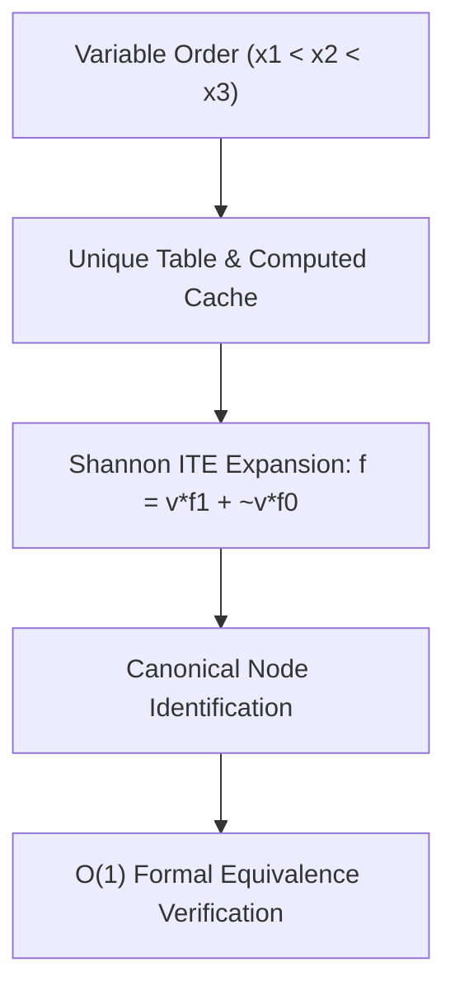

# ROBDD Canonical Decision Diagram Skill

Reduced Ordered Binary Decision Diagram (ROBDD) engine featuring hash-consed unique tables and the ITE operator.

## Features
- **100% Python Standard Library**: Pure memoized recursive data structure.
- **Canonical Representation**: Equivalence checking reduces to pointer/ID equality.
- **Complete Boolean Algebra**: AND, OR, NOT, XOR, and ITE operations.
